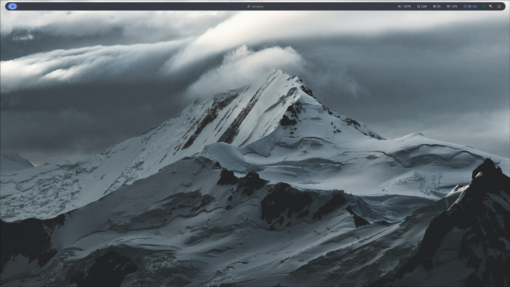
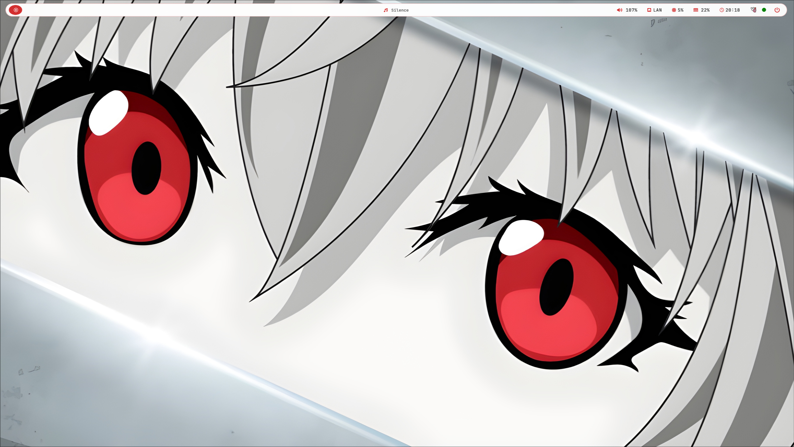
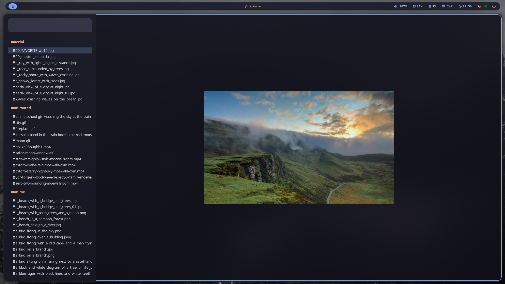
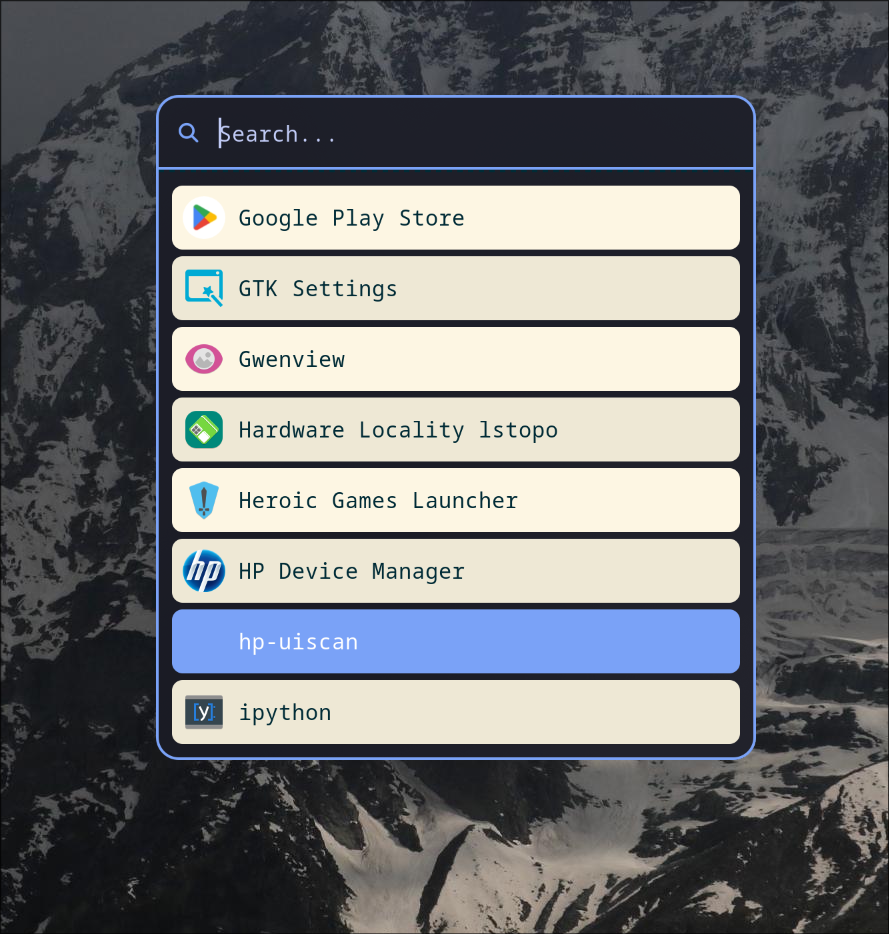
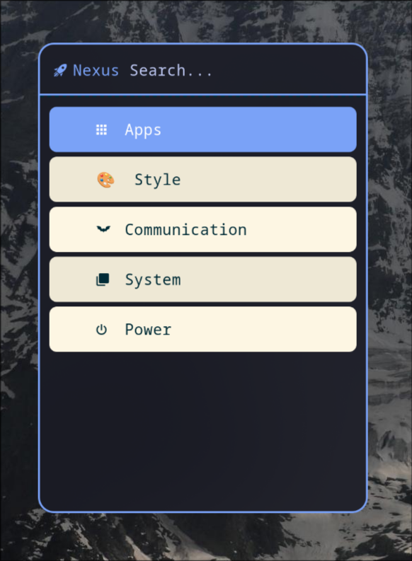

# DerJanniku-Dotfiles




My personal, high-performance desktop environment for Arch Linux. Built on Hyprland with a focus on aesthetics, productivity, and seamless theme-switching.

## Technical Specifications

| Component | Implementation |
| :--- | :--- |
| **Window Manager** | Hyprland (v0.45.2+) |
| **Status Bar** | Waybar (custom CSS/JS) |
| **Launcher** | Rofi (wayland-fork) |
| **Color Engine** | Matugen (Dynamic Image-to-Color) |
| **Terminal** | Kitty |
| **Shell** | ZSH + Starship |
| **Fonts** | JetBrains Mono Nerd Font |
| **Notifications** | Mako |

## Features

- **Integrated Voice Dictation (VibeFlow)**: Custom voice-to-text engine integration.
- **Dynamic Theming**: matugen-powered color generation on wallpaper change.
- **Showcase Mode**: Automated workspace orchestration for presentation.

## Usage

### Showcase Mode (`Meta + S`)
To instantly launch a professional demonstration layout (fastfetch, cava, nvim), run:
```bash
hypr-showcase
```

### Wallpaper Dashboard (`Meta + W`)
Python/GTK3 dashboard for real-time wallpaper management and live previews.



### App Launcher (`Meta + D`)
A clean, focused launcher for all installed applications.


### Nexus Search (`Meta + Escape`)
Central command hub for system controls, styling options, and communication.


## Quick Start

To install these dotfiles on a fresh Arch Linux system, run:

```bash
git clone https://github.com/DerJanniku/derjanniku-dotfiles.git ~/derjanniku-dotfiles
cd ~/derjanniku-dotfiles
chmod +x install.sh
./install.sh
```

### Prerequisites
- A working Arch Linux installation.
- An AUR helper like `yay` or `paru` (recommended).

## Theme Switching

Trigger the dynamic theme switcher at any time:
- **Hotkey:** `Meta + T`
- **Effect:** Instantly applies colors, transparency, and wallpapers to Hyprland, Waybar, Rofi, and Kitty.

## Structure

- **`current-active/`**: Core configuration files (Hyprland, Waybar, Rofi, Kitty).
- **`themes/`**: Visual styles and color schemes.
- **`docs/`**: Setup guides and technical notes.

## License
MIT License. Created by DerJanniku.